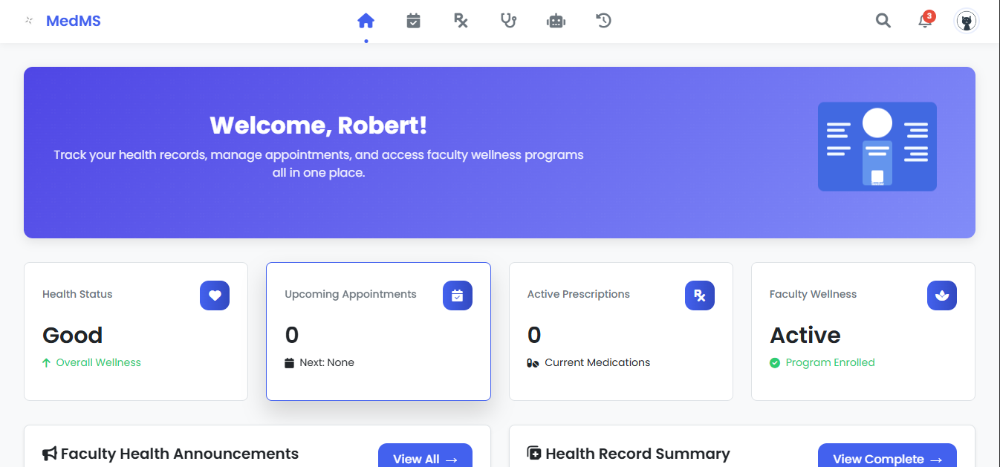
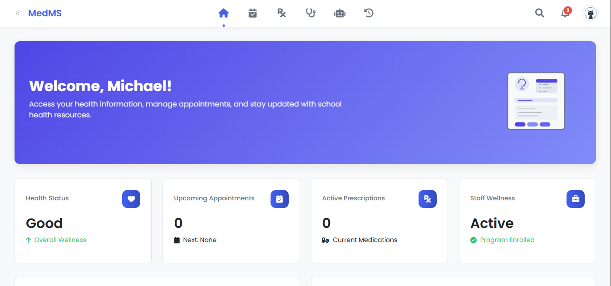

# MedMS - Medical Management System 🏥

<p align="center">
  
</p>

A comprehensive web-based healthcare management system designed for schools to manage student and staff health records, appointments, consultations, and medical resources.

## 📸 Screenshots

### Home Page
<p align="center">
  
</p>

### Login Page
<p align="center">
  
</p>

### Admin Dashboard
<p align="center">
  
</p>

### Student Dashboard
<p align="center">
  
</p>

### Teacher Dashboard
<p align="center">
  
</p>

### Staff Dashboard
<p align="center">
  
</p>

### Doctor Dashboard
<p align="center">
  
</p>

### Nurse Dashboard
<p align="center">
  
</p>

## 🏥 Features

- **User Management**: Role-based access for students, teachers, staff, and medical professionals
- **Appointment Management**: Schedule, track, and manage medical appointments
- **Medical Records**: Store and access complete medical histories, allergies, and medications
- **Prescriptions**: Create and manage digital prescriptions
- **Consultations**: Track and document patient consultations
- **First Aid Information**: Quick access to first aid procedures
- **Inventory Management**: Track medical supplies

## 🔧 Technologies

- PHP (Backend)
- MySQL (Database)
- HTML/CSS/JavaScript (Frontend)
- Font Awesome (Icons)

## 📋 Requirements

- PHP 7.4 or higher
- MySQL 5.7 or higher
- Apache/Nginx web server
- Web browser with JavaScript enabled

## 🚀 Installation

1. Clone this repository to your web server directory
2. Import the database schema from `database/schema.sql`
3. Configure database settings in `config/config.php`
4. Access the application through your web browser

## 📝 Configuration

Database configuration is located in `config/config.php`. Update the following settings:

```php
define('DB_SERVER', 'your_database_server');
define('DB_USERNAME', 'your_database_username');
define('DB_PASSWORD', 'your_database_password');
define('DB_NAME', 'medical_management');
```

## 🏗️ Project Structure

- `/assets` - Static assets (images, JS, CSS)
- `/config` - Configuration files
- `/database` - Database schema and migrations
- `/includes` - Shared components (header, footer, etc.)
- `/src` - Application source code
  - `/modules` - Application modules (dashboard, appointments, etc.)
  - `/auth` - Authentication functionality
  - `/styles` - CSS stylesheets

## 🔒 Security

- Password hashing for user authentication
- Session management for secure access
- Input validation and sanitization

## 🧩 Modules

- Dashboard
- Appointments
- Consultations
- Prescriptions
- Medical Records
- Vitals
- Chat
- Settings
- History

## 👥 User Roles

- Students
- Teachers
- Staff
- Medical Staff (Doctors/Nurses)
- Administrators

## 🎨 Logo Information

The MedMS logo features a modern, minimalist design with curved elements arranged in a flower-like pattern:
- Four curved gradient shapes radiating from a central point
- Small circular elements at each cardinal point
- Subtle gray gradient providing depth and dimension
- Clean, professional look that represents health and wellness

## 📞 Support

For technical support, please contact the system administrator or open an issue in the project repository.

## 📄 License

This project is proprietary and confidential. 