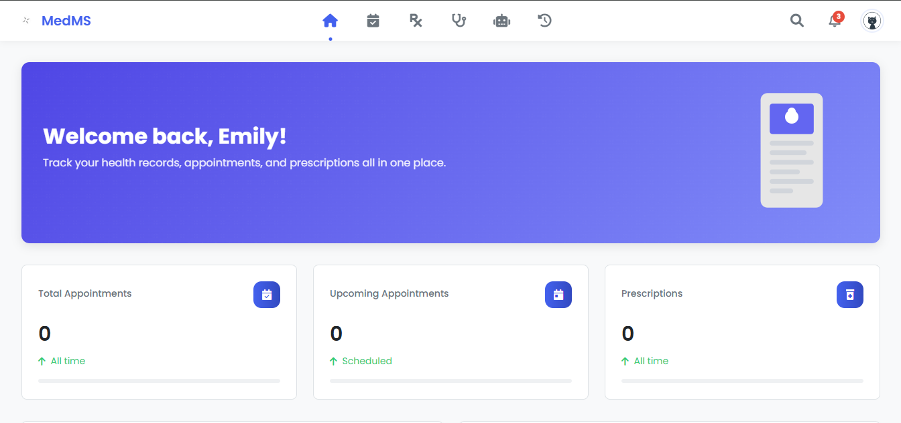

# MedMS - Medical Management System 🏥

<p align="center">
  
</p>

A comprehensive web-based healthcare management system designed for schools to manage student and staff health records, appointments, consultations, and medical resources.

## 📸 Screenshots

### Home Page
<p align="center">
  
</p>

### Login Page
<p align="center">
  
</p>

### Admin Dashboard
<p align="center">
  
</p>

### Student Dashboard
<p align="center">
  
</p>

### Teacher Dashboard
<p align="center">
  
</p>

### Staff Dashboard
<p align="center">
  
</p>

### Doctor Dashboard
<p align="center">
  
</p>

### Nurse Dashboard
<p align="center">
  
</p>

## 🏥 Features

- **User Management**: Role-based access for students, teachers, staff, and medical professionals
- **Appointment Management**: Schedule, track, and manage medical appointments
- **Medical Records**: Store and access complete medical histories, allergies, and medications
- **Prescriptions**: Create and manage digital prescriptions
- **Consultations**: Track and document patient consultations
- **First Aid Information**: Quick access to first aid procedures
- **Inventory Management**: Track medical supplies

## 🔧 Technologies

- PHP (Backend)
- MySQL (Database)
- HTML/CSS/JavaScript (Frontend)
- Font Awesome (Icons)

## 📋 Requirements

- PHP 7.4 or higher
- MySQL 5.7 or higher
- Apache/Nginx web server
- Web browser with JavaScript enabled

## 🚀 Installation

1. Clone this repository to your web server directory
2. Import the database schema from `database/schema.sql`
3. Configure database settings in `config/config.php`
4. Access the application through your web browser

## 📝 Configuration

Database configuration is located in `config/config.php`. Update the following settings:

```php
define('DB_SERVER', 'your_database_server');
define('DB_USERNAME', 'your_database_username');
define('DB_PASSWORD', 'your_database_password');
define('DB_NAME', 'medical_management');
```

## 🏗️ Project Structure

MedMS follows a modular architecture to keep the codebase organized and maintainable:

- `/assets` - Your visual and interactive resources
  - `/img` - Images including logos, icons, and UI elements
  - `/js` - JavaScript files for interactive functionality
  - `/css` - Stylesheets for the visual presentation

- `/config` - System configuration files
  - Contains database connection settings and global constants

- `/database` - Everything related to data storage
  - `/schema.sql` - Database structure for initial setup
  - Database migrations and seed data

- `/includes` - Reusable UI components
  - Contains header, footer, navigation, and other shared UI elements
  - These components are included across multiple pages for consistency

- `/src` - The heart of the application
  - `/modules` - Feature-specific functionality organized by domain
    - `/appointment` - Appointment scheduling and management
    - `/chat` - Messaging functionality
    - `/consultation` - Medical consultation records
    - `/dashboard` - User dashboards for different roles
    - `/history` - Medical history views and management
    - `/prescription` - Prescription creation and tracking
    - `/records` - Medical records management
    - `/settings` - User and system settings
    - `/vitals` - Patient vitals tracking
    - `/walkin` - Walk-in appointment handling
  - `/auth` - Authentication and authorization
    - User login, registration, and permission management
  - `/styles` - Module-specific CSS stylesheets

## 🔄 Working with the Codebase

### Development Workflow

1. **Entry Points**:
   - `index.php` - The main entry point to the application
   - `setup.php` - Used for initial system setup and configuration

2. **Adding New Features**:
   - Create a new module in `/src/modules/[feature_name]`
   - Implement backend logic in PHP files within the module
   - Add any module-specific styles to `/src/styles`
   - Update navigation in the relevant `/includes` files

3. **User Authentication Flow**:
   - User authentication is handled through `/src/auth`
   - Role-based access control determines which modules are accessible
   - Each user role has a dedicated dashboard experience

4. **Module Structure**:
   - Each module typically contains:
     - Main PHP file(s) for the feature's functionality
     - Form handlers for processing user input
     - View templates for rendering the UI
     - Module-specific JavaScript (if needed)

5. **Database Interaction**:
   - Database queries are centralized within each module
   - The configuration in `/config/config.php` establishes the database connection
   - Follow existing patterns for data retrieval and manipulation

### Best Practices

- Keep module code self-contained to maintain separation of concerns
- Reuse UI components from `/includes` whenever possible
- Follow the established naming conventions for files and functions
- Test new features across different user roles
- Document any new configuration options or dependencies

## 🔒 Security

- Password hashing for user authentication
- Session management for secure access
- Input validation and sanitization

## 🧩 Modules

- Dashboard
- Appointments
- Consultations
- Prescriptions
- Medical Records
- Vitals
- Chat
- Settings
- History

## 👥 User Roles

- Students
- Teachers
- Staff
- Medical Staff (Doctors/Nurses)
- Administrators

## 🎨 Logo Information

The MedMS logo features a modern, minimalist design with curved elements arranged in a flower-like pattern:
- Four curved gradient shapes radiating from a central point
- Small circular elements at each cardinal point
- Subtle gray gradient providing depth and dimension
- Clean, professional look that represents health and wellness

## 📞 Support

For technical support, please contact the system administrator or open an issue in the project repository.

## 📄 License

This project is proprietary and confidential. 